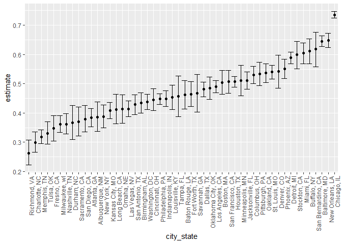
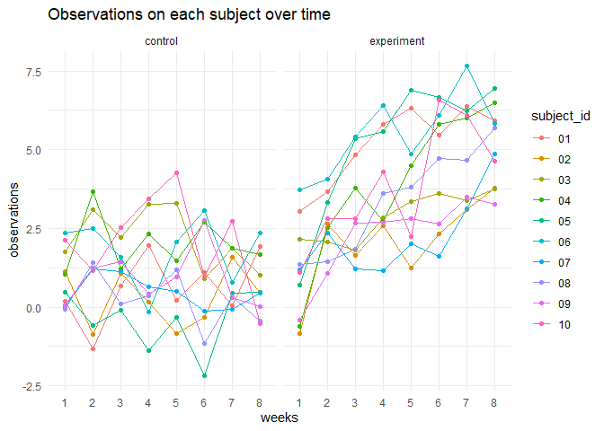
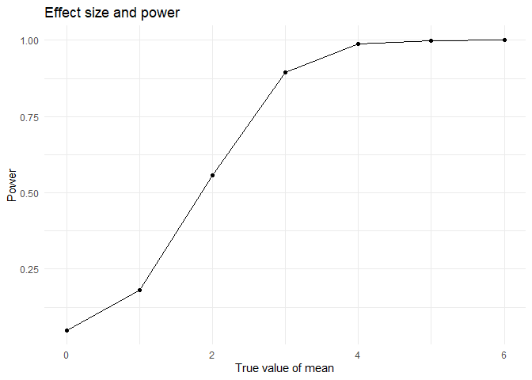
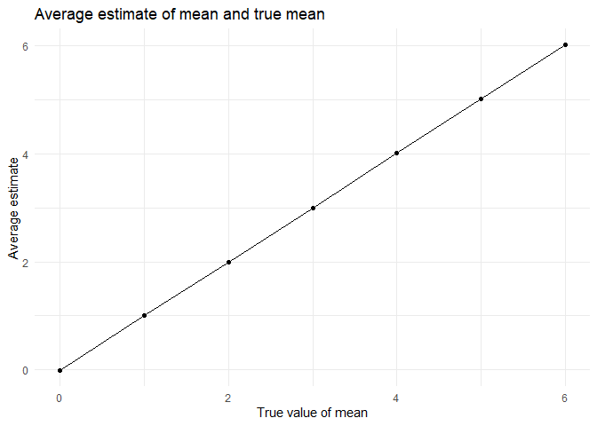
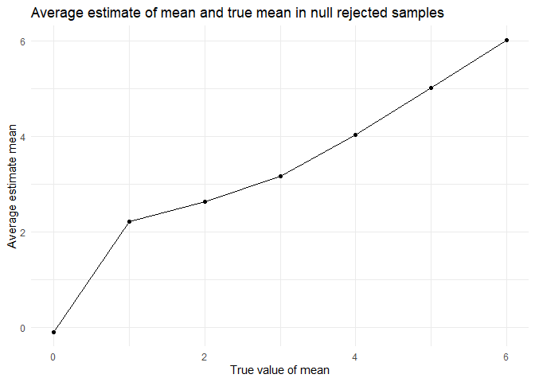
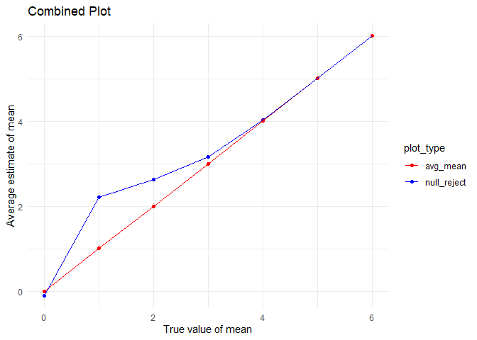

p8105_hw5_yz4719
================
Yuxin Zhang
2023-11-11

## Problem 1

For this problem, we are interested in data gathered and made public by
*The Washington Post* on homicides in 50 large U.S. cities. The code
chunk below imports and cleans the data.

``` r
homicide_df = 
  read_csv("data/homicide-data.csv", na = c("", "NA", "Unknown")) |>
  mutate(
    city_state = str_c(city, state, sep = ", "),
    resolution = case_when(
      disposition == "Closed without arrest" ~ "unsolved",
      disposition == "Open/No arrest"        ~ "unsolved",
      disposition == "Closed by arrest"      ~ "solved"
    )
  ) |> 
  filter(city_state != "Tulsa, AL") 
```

    ## Rows: 52179 Columns: 12
    ## ── Column specification ────────────────────────────────────────────────────────
    ## Delimiter: ","
    ## chr (8): uid, victim_last, victim_first, victim_race, victim_sex, city, stat...
    ## dbl (4): reported_date, victim_age, lat, lon
    ## 
    ## ℹ Use `spec()` to retrieve the full column specification for this data.
    ## ℹ Specify the column types or set `show_col_types = FALSE` to quiet this message.

The resulting dataframe has 52178 entries, on variables that include the
victim name, race, age, and sex; the date the homicide was reported; and
the location of the homicide. In cleaning, I created a `city_state`
variable that includes both city and state, and a `resolution` variable
to indicate whether the case was closed by arrest. I also excluded one
entry in Tulsa, AL, which is not a major US city and is most likely a
data entry error.

In the next code chunk, I group within cities and summarize to produce
the total number of homicides and the number that are solved.

``` r
city_homicide_df = 
  homicide_df |> 
  select(city_state, disposition, resolution) |> 
  group_by(city_state) |> 
  summarize(
    hom_total = n(),
    hom_unsolved = sum(resolution == "unsolved"))
```

Focusing only on Baltimore, MD, I can use the `prop.test` and
`broom::tidy` functions to obtain an estimate and CI of the proportion
of unsolved homicides in that city. The table below shows those values.

``` r
bmore_test = 
  prop.test(
    x = filter(city_homicide_df, city_state == "Baltimore, MD") |> pull(hom_unsolved),
    n = filter(city_homicide_df, city_state == "Baltimore, MD") |> pull(hom_total)) 

broom::tidy(bmore_test) |> 
  knitr::kable(digits = 3)
```

| estimate | statistic | p.value | parameter | conf.low | conf.high | method                                               | alternative |
|---------:|----------:|--------:|----------:|---------:|----------:|:-----------------------------------------------------|:------------|
|    0.646 |   239.011 |       0 |         1 |    0.628 |     0.663 | 1-sample proportions test with continuity correction | two.sided   |

Building on this code, I can use functions in the `purrr` package to
obtain estimates and CIs for the proportion of unsolved homicides in
each city in my dataset. The code below implements this analysis.

``` r
test_results = 
  city_homicide_df |> 
  mutate(
    prop_tests = map2(hom_unsolved, hom_total, \(x, y) prop.test(x = x, n = y)),
    tidy_tests = map(prop_tests, broom::tidy)) |> 
  select(-prop_tests) |> 
  unnest(tidy_tests) |> 
  select(city_state, estimate, conf.low, conf.high) |> 
  mutate(city_state = fct_reorder(city_state, estimate))
```

Finally, I make a plot showing the estimate (and CI) of the proportion
of unsolved homicides in each city.

``` r
test_results |> 
  mutate(city_state = fct_reorder(city_state, estimate)) |> 
  ggplot(aes(x = city_state, y = estimate)) + 
  geom_point() + 
  geom_errorbar(aes(ymin = conf.low, ymax = conf.high)) + 
  theme(axis.text.x = element_text(angle = 90, hjust = 1))
```

<!-- -->

This figure suggests a very wide range in the rate at which homicides
are solved – Chicago is noticeably high and, given the narrowness of the
CI, likely is the location of many homicides.

## Problem 2

Use this zip file which contains data from a longitudinal study that
included a control arm and an experimental arm. Data for each
participant is included in a separate file, and file names include the
subject ID and arm.

Create a tidy dataframe containing data from all participants, including
the subject ID, arm, and observations over time.

*Start with a dataframe containing all file names; the list.files
function will help,Iterate over file names and read in data for each
subject using purrr::map and saving the result as a new variable in the
dataframe*

``` r
q2_df = 
  tibble(
    files = list.files("data/q2data/"),
    path = str_c("data/q2data/", files)
  ) |>
  mutate(data = map(path, read_csv)) |>
  unnest()
```

    ## Rows: 1 Columns: 8
    ## ── Column specification ────────────────────────────────────────────────────────
    ## Delimiter: ","
    ## dbl (8): week_1, week_2, week_3, week_4, week_5, week_6, week_7, week_8
    ## 
    ## ℹ Use `spec()` to retrieve the full column specification for this data.
    ## ℹ Specify the column types or set `show_col_types = FALSE` to quiet this message.
    ## Rows: 1 Columns: 8
    ## ── Column specification ────────────────────────────────────────────────────────
    ## Delimiter: ","
    ## dbl (8): week_1, week_2, week_3, week_4, week_5, week_6, week_7, week_8
    ## 
    ## ℹ Use `spec()` to retrieve the full column specification for this data.
    ## ℹ Specify the column types or set `show_col_types = FALSE` to quiet this message.
    ## Rows: 1 Columns: 8
    ## ── Column specification ────────────────────────────────────────────────────────
    ## Delimiter: ","
    ## dbl (8): week_1, week_2, week_3, week_4, week_5, week_6, week_7, week_8
    ## 
    ## ℹ Use `spec()` to retrieve the full column specification for this data.
    ## ℹ Specify the column types or set `show_col_types = FALSE` to quiet this message.
    ## Rows: 1 Columns: 8
    ## ── Column specification ────────────────────────────────────────────────────────
    ## Delimiter: ","
    ## dbl (8): week_1, week_2, week_3, week_4, week_5, week_6, week_7, week_8
    ## 
    ## ℹ Use `spec()` to retrieve the full column specification for this data.
    ## ℹ Specify the column types or set `show_col_types = FALSE` to quiet this message.
    ## Rows: 1 Columns: 8
    ## ── Column specification ────────────────────────────────────────────────────────
    ## Delimiter: ","
    ## dbl (8): week_1, week_2, week_3, week_4, week_5, week_6, week_7, week_8
    ## 
    ## ℹ Use `spec()` to retrieve the full column specification for this data.
    ## ℹ Specify the column types or set `show_col_types = FALSE` to quiet this message.
    ## Rows: 1 Columns: 8
    ## ── Column specification ────────────────────────────────────────────────────────
    ## Delimiter: ","
    ## dbl (8): week_1, week_2, week_3, week_4, week_5, week_6, week_7, week_8
    ## 
    ## ℹ Use `spec()` to retrieve the full column specification for this data.
    ## ℹ Specify the column types or set `show_col_types = FALSE` to quiet this message.
    ## Rows: 1 Columns: 8
    ## ── Column specification ────────────────────────────────────────────────────────
    ## Delimiter: ","
    ## dbl (8): week_1, week_2, week_3, week_4, week_5, week_6, week_7, week_8
    ## 
    ## ℹ Use `spec()` to retrieve the full column specification for this data.
    ## ℹ Specify the column types or set `show_col_types = FALSE` to quiet this message.
    ## Rows: 1 Columns: 8
    ## ── Column specification ────────────────────────────────────────────────────────
    ## Delimiter: ","
    ## dbl (8): week_1, week_2, week_3, week_4, week_5, week_6, week_7, week_8
    ## 
    ## ℹ Use `spec()` to retrieve the full column specification for this data.
    ## ℹ Specify the column types or set `show_col_types = FALSE` to quiet this message.
    ## Rows: 1 Columns: 8
    ## ── Column specification ────────────────────────────────────────────────────────
    ## Delimiter: ","
    ## dbl (8): week_1, week_2, week_3, week_4, week_5, week_6, week_7, week_8
    ## 
    ## ℹ Use `spec()` to retrieve the full column specification for this data.
    ## ℹ Specify the column types or set `show_col_types = FALSE` to quiet this message.
    ## Rows: 1 Columns: 8
    ## ── Column specification ────────────────────────────────────────────────────────
    ## Delimiter: ","
    ## dbl (8): week_1, week_2, week_3, week_4, week_5, week_6, week_7, week_8
    ## 
    ## ℹ Use `spec()` to retrieve the full column specification for this data.
    ## ℹ Specify the column types or set `show_col_types = FALSE` to quiet this message.
    ## Rows: 1 Columns: 8
    ## ── Column specification ────────────────────────────────────────────────────────
    ## Delimiter: ","
    ## dbl (8): week_1, week_2, week_3, week_4, week_5, week_6, week_7, week_8
    ## 
    ## ℹ Use `spec()` to retrieve the full column specification for this data.
    ## ℹ Specify the column types or set `show_col_types = FALSE` to quiet this message.
    ## Rows: 1 Columns: 8
    ## ── Column specification ────────────────────────────────────────────────────────
    ## Delimiter: ","
    ## dbl (8): week_1, week_2, week_3, week_4, week_5, week_6, week_7, week_8
    ## 
    ## ℹ Use `spec()` to retrieve the full column specification for this data.
    ## ℹ Specify the column types or set `show_col_types = FALSE` to quiet this message.
    ## Rows: 1 Columns: 8
    ## ── Column specification ────────────────────────────────────────────────────────
    ## Delimiter: ","
    ## dbl (8): week_1, week_2, week_3, week_4, week_5, week_6, week_7, week_8
    ## 
    ## ℹ Use `spec()` to retrieve the full column specification for this data.
    ## ℹ Specify the column types or set `show_col_types = FALSE` to quiet this message.
    ## Rows: 1 Columns: 8
    ## ── Column specification ────────────────────────────────────────────────────────
    ## Delimiter: ","
    ## dbl (8): week_1, week_2, week_3, week_4, week_5, week_6, week_7, week_8
    ## 
    ## ℹ Use `spec()` to retrieve the full column specification for this data.
    ## ℹ Specify the column types or set `show_col_types = FALSE` to quiet this message.
    ## Rows: 1 Columns: 8
    ## ── Column specification ────────────────────────────────────────────────────────
    ## Delimiter: ","
    ## dbl (8): week_1, week_2, week_3, week_4, week_5, week_6, week_7, week_8
    ## 
    ## ℹ Use `spec()` to retrieve the full column specification for this data.
    ## ℹ Specify the column types or set `show_col_types = FALSE` to quiet this message.
    ## Rows: 1 Columns: 8
    ## ── Column specification ────────────────────────────────────────────────────────
    ## Delimiter: ","
    ## dbl (8): week_1, week_2, week_3, week_4, week_5, week_6, week_7, week_8
    ## 
    ## ℹ Use `spec()` to retrieve the full column specification for this data.
    ## ℹ Specify the column types or set `show_col_types = FALSE` to quiet this message.
    ## Rows: 1 Columns: 8
    ## ── Column specification ────────────────────────────────────────────────────────
    ## Delimiter: ","
    ## dbl (8): week_1, week_2, week_3, week_4, week_5, week_6, week_7, week_8
    ## 
    ## ℹ Use `spec()` to retrieve the full column specification for this data.
    ## ℹ Specify the column types or set `show_col_types = FALSE` to quiet this message.
    ## Rows: 1 Columns: 8
    ## ── Column specification ────────────────────────────────────────────────────────
    ## Delimiter: ","
    ## dbl (8): week_1, week_2, week_3, week_4, week_5, week_6, week_7, week_8
    ## 
    ## ℹ Use `spec()` to retrieve the full column specification for this data.
    ## ℹ Specify the column types or set `show_col_types = FALSE` to quiet this message.
    ## Rows: 1 Columns: 8
    ## ── Column specification ────────────────────────────────────────────────────────
    ## Delimiter: ","
    ## dbl (8): week_1, week_2, week_3, week_4, week_5, week_6, week_7, week_8
    ## 
    ## ℹ Use `spec()` to retrieve the full column specification for this data.
    ## ℹ Specify the column types or set `show_col_types = FALSE` to quiet this message.
    ## Rows: 1 Columns: 8
    ## ── Column specification ────────────────────────────────────────────────────────
    ## Delimiter: ","
    ## dbl (8): week_1, week_2, week_3, week_4, week_5, week_6, week_7, week_8
    ## 
    ## ℹ Use `spec()` to retrieve the full column specification for this data.
    ## ℹ Specify the column types or set `show_col_types = FALSE` to quiet this message.

*Tidy the result; manipulate file names to include control arm and
subject ID, make sure weekly observations are “tidy”, and do any other
tidying that’s necessary*

``` r
q2_tidy_df = 
  q2_df|>
  janitor::clean_names() |>
  separate(files, into = c("arm", "subject_id"), sep = "_") |>
  mutate(
    arm = case_match(
      arm, 
      "con" ~ "control", 
      "exp" ~ "experiment")) |>
  mutate(subject_id = str_replace(subject_id, ".csv", "")) |>
  pivot_longer(week_1:week_8, 
               names_to = "week",
               names_prefix = "week_",
               values_to = "observation") |>
  select(arm, subject_id, week, observation)

q2_tidy_df
```

    ## # A tibble: 160 × 4
    ##    arm     subject_id week  observation
    ##    <chr>   <chr>      <chr>       <dbl>
    ##  1 control 01         1            0.2 
    ##  2 control 01         2           -1.31
    ##  3 control 01         3            0.66
    ##  4 control 01         4            1.96
    ##  5 control 01         5            0.23
    ##  6 control 01         6            1.09
    ##  7 control 01         7            0.05
    ##  8 control 01         8            1.94
    ##  9 control 02         1            1.13
    ## 10 control 02         2           -0.88
    ## # ℹ 150 more rows

*Make a spaghetti plot showing observations on each subject over time,
and comment on differences between groups*

``` r
q2_tidy_df|>
  ggplot(aes(x = week, y = observation, group = subject_id, color = subject_id)) +
  geom_point()+
  geom_line() +
  facet_grid(.~arm) +
  labs(x = "weeks",
       y = "observations",
       title = "Observations on each subject over time") + theme_minimal()
```

<!-- -->

**The spaghetti plot shows that the observations on each subject in
control group fluctuates but remain stable, while those in experimental
group are increasing over time. And compared to control group, the mean
values of observations of each subject are higher in experimental
group.**

## Question 3

*First set the following design elements:Fix n=30, Fix σ=5*

*Set μ=0. Generate 5000 datasets from the model: x∼Normal\[μ,σ\]*

*For each dataset, save μ^ and the p-value arising from a test of H:μ=0
using α=0.05.*

``` r
set.seed(1)
sim_norm =
  function(n=30, mu, sd=5){
    x = rnorm(n, mean=mu, sd)
    test_result = t.test(x)|>
      broom::tidy() |>
      select(estimate, p.value)
    }
```

``` r
sim_mu_0 =
  rerun(5000, sim_norm(mu = 0)) |> 
  bind_rows() |> 
  select(estimate, p.value)
```

    ## Warning: `rerun()` was deprecated in purrr 1.0.0.
    ## ℹ Please use `map()` instead.
    ##   # Previously
    ##   rerun(5000, sim_norm(mu = 0))
    ## 
    ##   # Now
    ##   map(1:5000, ~ sim_norm(mu = 0))
    ## This warning is displayed once every 8 hours.
    ## Call `lifecycle::last_lifecycle_warnings()` to see where this warning was
    ## generated.

*repeat the above for μ=1,2,3,4,5,6*

``` r
sim_mu = 
 tibble(mu = c(0, 1, 2, 3, 4, 5, 6)
        ) |> 
  mutate(
    output_list = map(.x = mu, ~ rerun(5000, sim_norm(mu = .x, sd=5))),
    estimate_df = map(output_list, bind_rows)
    )|>  
  unnest(estimate_df) |> 
  select(-output_list)
```

    ## Warning: There was 1 warning in `mutate()`.
    ## ℹ In argument: `output_list = map(.x = mu, ~rerun(5000, sim_norm(mu = .x, sd =
    ##   5)))`.
    ## Caused by warning:
    ## ! `rerun()` was deprecated in purrr 1.0.0.
    ## ℹ Please use `map()` instead.
    ##   # Previously
    ##   rerun(5000, sim_norm(mu = .x, sd = 5))
    ## 
    ##   # Now
    ##   map(1:5000, ~ sim_norm(mu = .x, sd = 5))

*Make a plot showing the proportion of times the null was rejected (the
power of the test) on the y axis and the true value of μ on the x axis.
Describe the association between effect size and power.*

``` r
plot_power_df = 
  sim_mu |>
  group_by(mu) |>
  summarize(reject = sum(p.value < 0.05)/5000) |>
  ggplot(aes(x = mu, y = reject)) +
  geom_point() +
  geom_line() +
  labs(
    title = "Effect size and power",
    x = "True value of mean",
    y = "Power") +
    theme_minimal()

plot_power_df
```

<!-- -->

**The plot indicates a positive linear correlation between the power of
the test and the true value of μ, showing that as μ increases from 1 to
6, the proportion of times the null hypothesis is rejected also
increases. This trend highlights that larger effect sizes, which are
easier to detect, are associated with increased power, ultimately
leading to a higher likelihood of detecting statistically significant
differences as the effect size grows.**

*Make a plot showing the average estimate of μ^ on the y axis and the
true value of μ on the x axis. Make a second plot (or overlay on the
first) the average estimate of μ^ only in samples for which the null was
rejected on the y axis and the true value of μ on the x axis. Is the
sample average of μ^ across tests for which the null is rejected
approximately equal to the true value of μ? Why or why not?*

``` r
plot_avg_mean_df= 
  sim_mu |> 
  group_by(mu) |> 
  mutate(avg_mean = mean(estimate)) |> 
  ggplot(aes(x = mu, y = avg_mean ))+
  geom_point() +
  geom_line() +
  labs(
    title = "Average estimate of mean and true mean",
    x = "True value of mean",
    y = "Average estimate"
  ) +
  theme_minimal()

plot_avg_mean_df
```

<!-- -->

**This shows that the average estimated mean closely aligns with the
true mean, adhering to a relationship best represented by the linear
equation y = x.**

*Make a second plot (or overlay on the first) the average estimate of μ^
only in samples for which the null was rejected on the y axis and the
true value of μ on the x axis. Is the sample average of μ^ across tests
for which the null is rejected approximately equal to the true value of
μ ? Why or why not?*

``` r
plot_null_reject_df =  
  sim_mu |> 
  filter(p.value < 0.05) |> 
  group_by(mu) |> 
  mutate(avg_mean = mean(estimate)) |> 
  ggplot(aes(x = mu, y = avg_mean ))+
  geom_point()+
  geom_line() +
  labs(
    title = "Average estimate of mean and true mean in null rejected samples",
    x = "True value of mean",
    y = "Average estimate mean"
  ) + 
  theme_minimal() 

plot_null_reject_df
```

<!-- -->

``` r
null_reject_data <- sim_mu |>
  filter(p.value < 0.05) |>
  group_by(mu) |>
  summarise(avg_mean = mean(estimate)) |>
  mutate(plot_type = "null_reject")

avg_mean_data <- sim_mu |>
  group_by(mu) |>
  summarise(avg_mean = mean(estimate)) |>
  mutate(plot_type = "avg_mean")

# Combine the data
combined_data <- rbind(null_reject_data, avg_mean_data)

combined_plot <- ggplot(combined_data, aes(x = mu, y = avg_mean, color = plot_type)) +
  geom_point() +
  geom_line(aes(group = plot_type)) +
  labs(
    title = "Combined Plot",
    x = "True value of mean",
    y = "Average estimate of mean"
  ) +
  theme_minimal() +
  scale_color_manual(values = c("null_reject" = "blue", "avg_mean" = "red"))

print(combined_plot)
```

<!-- -->

**the average estimate of μ^ for tests where the null is rejected (blue
line) does not always match the true value of μ, particularly when the
true mean is low. This suggests that the null hypothesis is more likely
to be rejected due to sampling variability, leading to an overestimation
of the true effect size when it is small or non-existent.**

**As the true value of μ increases, the average estimate of μ^ from
tests with rejected null hypotheses becomes a better approximation of
the true mean, indicating that with larger true effects, the power of
the test increases, and the sample mean is a more accurate estimator of
the true mean. This reflects the influence of test sensitivity and the
reduction of Type II errors as the effect size grows.**
